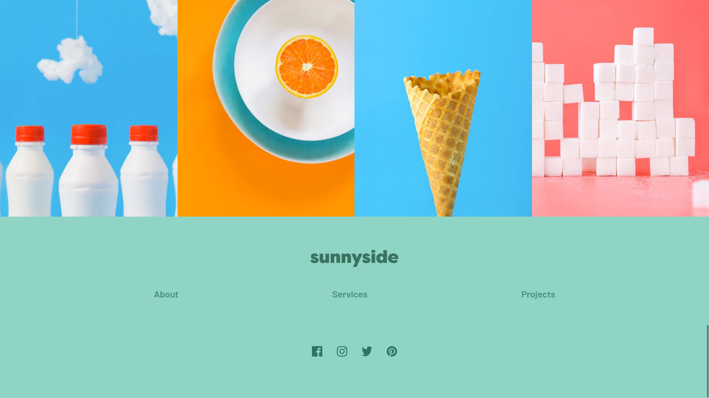

# Sunnyside Agency

## Description

Ceci est la page d'accueil de l'agence Sunnyside. Elle est conçue pour être responsive et s'affiche correctement sur tous les appareils.

## Installation

Pour installer ce projet, suivez ces étapes :

1. Clonez le dépôt : `git clone <url du Repo>`
2. Ouvrez le fichier `index.html` dans votre navigateur ou avec LiveServer.

## Author

- Valentin Lefort

## Date

09/2023

## Screenshot

